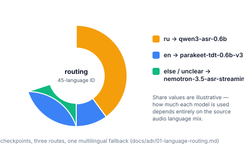
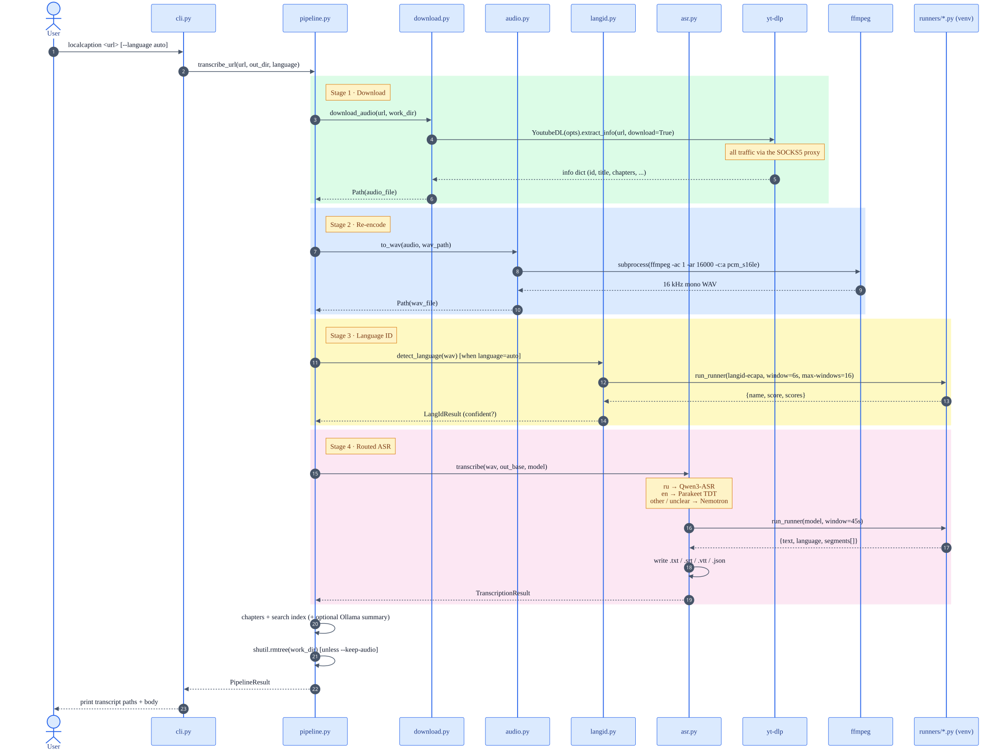

<div align="center">

 

# localcaption

Fully-local transcription for YouTube and local files. Language-ID routing, three specialist ASR models, SRT/VTT/JSON out. No API key.

<!-- Package -->
<p>
  <a href="https://pypi.org/project/localcaption/"></a>
  <a href="https://pypi.org/project/localcaption/"></a>
  <a href="LICENSE"></a>
</p>

<!-- Build -->
<p>
  <a href="https://github.com/jatinkrmalik/localcaption/actions/workflows/ci.yml"></a>
  <a href="https://github.com/jatinkrmalik/localcaption/actions/workflows/release.yml"></a>
  <a href="https://github.com/pypa/hatch"></a>
</p>

<!-- Community -->
<p>
  <a href="https://github.com/jatinkrmalik/localcaption/stargazers"></a>
  <a href="https://github.com/jatinkrmalik/localcaption/commits/main"></a>
  <a href="https://github.com/jatinkrmalik/localcaption/issues"></a>
  <a href="docs/governance/01-contributing.md"></a>
</p>

```bash
pipx install localcaption && localcaption doctor --fix # to get started
```

</div>

> [!TIP]
> Local, offline transcription for YouTube, Vimeo, Twitch, Twitter/X, and [1000+ other sites](https://github.com/yt-dlp/yt-dlp/blob/master/supportedsites.md) via yt-dlp, plus any video or audio file on disk. Paste a URL or a path; get a `.md` transcript by default (`--output-format` adds `.txt`, `.srt`, `.vtt`, or `.json`) without an API key and without uploading audio to the cloud. A speechbrain language-ID model picks between [Qwen3-ASR](https://huggingface.co/Qwen/Qwen3-ASR-0.6B), [Parakeet TDT](https://huggingface.co/nvidia/parakeet-tdt-0.6b-v3), and [Nemotron 3.5 ASR](https://huggingface.co/nvidia/nemotron-3.5-asr-streaming-0.6b).

`localcaption` is a tiny orchestrator over four stages:

| Stage | Tool |
|---|---|
| Download best audio | [`yt-dlp`](https://github.com/yt-dlp/yt-dlp) (YouTube, Vimeo, Twitch, 1000+ sites) |
| Re-encode to 16 kHz mono WAV | [`ffmpeg`](https://ffmpeg.org/) |
| Detect the language | [`speechbrain`](https://speechbrain.github.io/) ECAPA-TDNN (45 languages) |
| Transcribe locally | Qwen3-ASR 0.6B · Parakeet TDT 0.6B v3 · Nemotron 3.5 ASR 0.6B |

Nothing is uploaded to a third-party service. No OpenAI / Google / DeepL keys
required. Unlike pasting a clip into ChatGPT or calling the Whisper API,
transcription stays on your laptop after the download.


## Documentation

Everything lives in [`docs/`](docs) (master index: [docs/README.md](docs/README.md)):

| Folder | Contents |
|---|---|
| [docs/adr](docs/adr/README.md) | Architecture Decision Records: language routing, isolated runtimes, proxy-first networking, search index, local summaries |
| [docs/design](docs/design/README.md) | Research notes: pipeline stages, model selection, GPU offload, batch & playlists, chapters & search, output formats |
| [docs/networking](docs/networking/README.md) | SOCKS5/Tor policy, circuit rotation, YouTube bot-check mitigation, cookie sources |
| [docs/models](docs/models/README.md) | The four checkpoints, the isolated runtimes, and language identification |
| [docs/api](docs/api/README.md) | CLI reference, Python API, configuration, error model |
| [docs/operations](docs/operations/README.md) | Installation, `doctor --fix`, release procedure |
| [docs/governance](docs/governance/README.md) | Contributing, Code of Conduct, security policy, changelog |

## Why localcaption

- **Offline models.** Audio is transcribed on your machine. No API key, no account.
- **Language routing.** A 45-language ID model sends Russian to Qwen3-ASR, English to Parakeet, and everything else to Nemotron.
- **URLs and local files.** Any URL [yt-dlp](https://github.com/yt-dlp/yt-dlp) supports, plus local `.mp4` / `.wav` / `.mp3` / similar.
- **Captions you can use.** One run writes a single `.md` by default (use `--output-format` for `.txt`/`.srt`/`.vtt`/`.json`/`all`).
- **Batch.** `--batch urls.txt` walks a list of URLs or files.
- **Chapters.** With `--output-format md` (default) YouTube chapter markers are folded into that single `.md`; other formats also emit `.chapters.json` and `.chaptered.md`.
- **Search.** `localcaption search <term>` greps past transcripts with timestamps.
- **Local summaries.** `--summary` talks to a local [Ollama](https://ollama.com), not a hosted LLM.
- **Proxy-first.** All network traffic (downloads, model fetches, child processes) can be routed through a SOCKS5 proxy. When YouTube raises a "Sign in to confirm you're not a bot" block on a Tor exit, the downloader rotates to a fresh Tor exit (`SIGNAL NEWNYM`) and optionally authenticates with a browser cookie jar (`--cookies`) to get past it.
- **`doctor --fix`.** Installs missing tools, builds the model runtimes, and downloads the checkpoints.

## Why three ASR models?

One model rarely wins everywhere. The 0.6B models below are small enough to
infer on CPU yet state-of-the-art for their niche — and run on the NVIDIA GPU
when available:

| Model | Role | Size | Why |
|---|---|---|---|
| [Qwen3-ASR 0.6B](https://huggingface.co/Qwen/Qwen3-ASR-0.6B) | Russian | ~1.9 GiB | Best-in-class Russian WER at 0.6B |
| [Parakeet TDT 0.6B v3](https://huggingface.co/nvidia/parakeet-tdt-0.6b-v3) | English | ~2.4 GiB | Top of the Open ASR leaderboard |
| [Nemotron 3.5 ASR Streaming 0.6B](https://huggingface.co/nvidia/nemotron-3.5-asr-streaming-0.6b) | 40+ languages | ~2.5 GiB | Multilingual catch-all fallback |
| [speechbrain lang-id-commonlanguage_ecapa](https://huggingface.co/speechbrain/lang-id-commonlanguage_ecapa) | routing | ~84 MB | 45-language classifier |

```
                        ┌── ru ──────────────► Qwen3-ASR 0.6B
 language-ID (ECAPA) ───┼── en ──────────────► Parakeet TDT 0.6B v3
 45 langs, 6s window     └── else / unclear ──► Nemotron 3.5 ASR 0.6B
```



If the language is unclear (best posterior < 0.6), localcaption falls back to
the multilingual Nemotron model instead of guessing.

## Who this is for

- Podcasters and video folks who need SRT/VTT without uploading episodes.
- Researchers transcribing interviews or lectures they cannot send to a cloud API.
- Anyone who wants a YouTube transcript without logging into Google or pasting audio into ChatGPT.

## Install

### Prerequisites

- Python 3.10+
- `git`, `ffmpeg`, `curl` on your `$PATH`
  (macOS: `brew install ffmpeg`)

### Recommended: pipx (one line)

The most Pythonic install. [`pipx`](https://pipx.pypa.io) creates an isolated
virtualenv for `localcaption` and drops the console script on your `$PATH`,
so you can run `localcaption <url-or-file>` from anywhere without polluting your
system Python.

```bash
pipx install localcaption
```

The first time you run `localcaption <url-or-file>` it will tell you it can't find
the model runtimes. The fastest way to set everything up is to let
`localcaption` do it itself: build the runtimes and download the checkpoints:

```bash
localcaption doctor --fix
```

`doctor --fix` is idempotent and end-to-end: it installs missing system
tools (`ffmpeg`/`git`/`curl` via `brew`/`apt`), builds one isolated Python
runtime per model family, downloads the checkpoints, and re-runs the
diagnostics to confirm everything works.

Prefer to do it yourself?

```bash
# Option A: bootstrap script (also installs pipx + the localcaption package):
curl -fsSL https://raw.githubusercontent.com/jatinkrmalik/localcaption/main/scripts/install.sh | bash

# Option B: DIY. Build the runtimes and fetch the models, then verify:
bash scripts/setup_runtime.sh
localcaption model download --all
localcaption doctor
```

> 💡 The model runtimes live in `runtime/` and the checkpoints in `models/`
> (both overridable, see [Configuration](#configuration)). A full install is
> roughly 7 GB of weights, so the download takes a while on a slow link.

After install, verify everything is wired up:

```bash
localcaption doctor                # read-only diagnostic
localcaption doctor --fix          # diagnostic + auto-repair anything missing
```

### Uninstall

To completely remove `localcaption` and everything it installed (the
binary, the model runtimes, and the checkpoints):

```bash
# pipx + runtimes + models, with confirmation prompts:
curl -fsSL https://raw.githubusercontent.com/jatinkrmalik/localcaption/main/scripts/uninstall.sh | bash

# Or, if you cloned the repo:
bash scripts/uninstall.sh
```

Useful flags: `--dry-run` (preview), `--yes` (skip prompts),
`--keep-models` (uninstall the binary but keep the runtimes + checkpoints
for next time).

Sample output:

```
localcaption 0.4.1

System tools:
  ✅ python  (3.12.14)
  ✅ ffmpeg  (/usr/bin/ffmpeg)
  ✅ git     (/usr/bin/git)
  ✅ curl    (/usr/bin/curl)

Python dependencies:
  ✅ yt-dlp  (2026.08.19)

Network:
  ✅ proxy  (socks5h://127.0.0.1:9050 (reachable))

Model runtimes:
  ✅ langid  (torch, speechbrain)
  ✅ qwen    (torch, qwen_asr)
  ✅ nvidia  (torch, transformers)

Models:
  ✅ langid-ecapa (~84 MB)  (ECAPA-TDNN language identifier, 45 languages (routing))
  ✅ qwen3-asr-0.6b (~1.9 GB)  (Qwen3-ASR 0.6B — Russian (WER 5.13))
  ✅ parakeet-tdt-0.6b-v3 (~2.4 GB)  (NVIDIA Parakeet TDT 0.6B v3 — English (Open ASR #1))
  ✅ nemotron-3.5-asr-streaming-0.6b (~2.5 GB)  (NVIDIA Nemotron 3.5 ASR Streaming 0.6B — 40 languages)

All checks passed. You're good to go: localcaption <url-or-file>
```

If anything is missing, re-run with `--fix` and `localcaption` will build the
missing runtimes, download the missing checkpoints, then re-verify.

### Dev install (contributors)

If you're hacking on `localcaption` itself, install editable from a clone:

```bash
git clone https://github.com/jatinkrmalik/localcaption
cd localcaption
./scripts/setup.sh           # creates runtime/main, installs -e .[dev], builds all runtimes
source runtime/main/bin/activate
pytest                        # the suite should pass
```

The dev setup keeps `runtime/` and `models/` inside the repo (so you can poke
at them) and editable-installs the package into `runtime/main` so source edits
take effect immediately.

## Usage

### CLI

```bash
# YouTube
localcaption "https://www.youtube.com/watch?v=dQw4w9WgXcQ"

# Vimeo, Twitch, Twitter/X, and 1000+ other sites work too
localcaption "https://vimeo.com/148751763"

# Local video/audio files
localcaption /path/to/video.mp4
localcaption ./recording.wav

# Force a model and skip language detection
localcaption ./talk.mp4 --language ru

# Batch: one URL or local path per line (# comments and blank lines ignored)
localcaption --batch urls.txt -o transcripts/

# Transcript + local summary (requires a running Ollama)
localcaption "https://www.youtube.com/watch?v=dQw4w9WgXcQ" --summary
localcaption ./talk.mp4 --summary --summary-model llama3.1:8b
```

| flag | default | what it does |
|---|---|---|
| `-o`, `--out` | `./transcripts` | output directory |
| `-l`, `--language` | `auto` | ISO code or language name, or `auto` to detect |
| `--model KEY` | routing | force a specific ASR model key, skip language routing |
| `--keep-audio` | off | keep the downloaded audio + intermediate WAV in `<out>/.work/` |
| `--no-print` | off | don't echo the transcript to stdout |
| `--auto-download` | off | download missing models without prompting |
| `--cookies BROWSER_OR_FILE` | auto | yt-dlp cookie source for YouTube: a browser name (`firefox`, `chrome`, …) or a Netscape cookie file. Auto-detected when omitted. |
| `--no-proxy` | off | bypass `LOCALCAPTION_PROXY` for this run (direct connection). Use when the Tor exit is flagged but your own line is clean. |
| `--rotate-tor` | off | request a fresh Tor exit circuit before downloading. Also done automatically on any bot-check block. |
| `--no-playlist` | off | only transcribe the first video in a playlist URL; ignore the rest (default: transcribe every video) |
| `--playlist-limit N` | off | transcribe only the first N videos of a playlist URL |
| `--batch FILE` | off | transcribe each non-empty, non-`#` line in FILE sequentially; playlist URLs in the file are auto-expanded |
| `--summary` | off | after transcription, write `<id>.summary.md` via local Ollama |
| `--summary-model` | `llama3.1:8b` | Ollama model used by `--summary` |
| `--summary-prompt` | built-in | path to a prompt template (`{transcript}` is replaced if present) |

Outputs a single `<id>.md` by default (use `--output-format txt|srt|vtt|json|all`
for the other formats). For local files, the output filename is derived from the
input file's name. With `--summary`, also writes `<id>.summary.md`. When the
source has chapter markers (typical on YouTube), they are folded into that single
`.md` (default); with other formats, also `<id>.chapters.json` and
`<id>.chaptered.md` are written.

`--batch FILE` writes each item into `<out>/<videoId>/` and skips any video
whose `.md` (or `.txt`, for non-md runs) is already there, so you can re-run a
list after a failure. A line that is a YouTube playlist URL (`&list=...`)
is expanded in place to its individual videos.
Local paths are relative to the list file (and `~` is expanded). The process
is sequential (a model already saturates the machine). Exit 0 if everything
succeeded or was skipped, 1 otherwise.

A URL that carries a playlist id (`https://…/watch?v=ID&list=PL…`) is
auto-expanded to every video in the list. Each video is transcribed
sequentially into its own `<out>/<id>/<id>.md` directory, and already-done
videos are skipped on re-runs. Use `--no-playlist` to transcribe only the
first video, or `--playlist-limit N` to cap the list.

You can also invoke it as a module: `python -m localcaption <url-or-file>`.

### Summaries (optional)

If [Ollama](https://ollama.com) is running locally, `--summary` sends the
`.txt` transcript to `http://localhost:11434/api/generate` and writes
`<id>.summary.md` next to it. The built-in prompt asks for a TL;DR, key
points, notable quotes, and action items.

```bash
localcaption <url-or-file> --summary
localcaption <url-or-file> --summary --summary-model mistral
localcaption <url-or-file> --summary --summary-prompt ./my_prompt.txt
```

If Ollama isn't reachable, localcaption logs a warning and still exits 0.
The transcript files are unchanged.

### Subcommands

| Subcommand | What it does |
|---|---|
| _(default)_ `localcaption <url-or-file>` | Transcribe a URL or local video/audio file. |
| `localcaption doctor` | Read-only diagnostic: tools, proxy, runtimes, checkpoints. Useful before filing a bug. |
| `localcaption doctor --fix` | Self-heal: install missing tools, build the runtimes, download missing models, then re-verify. Idempotent. |
| `localcaption model list` | List every supported model with role + size + install status. |
| `localcaption model info <key>` | Show metadata about a single model. |
| `localcaption model download <key>` | Download a model (or `--all`) with resumable transfers. |
| `localcaption model rm <key>` | Remove an installed model to free disk space. |
| `localcaption search <term>` | Grep previously transcribed videos. Ranked matches with timestamps. |

### Search past transcripts

Each successful transcription upserts one JSON line in
`~/.local/share/localcaption/index.jsonl` (`id`, `url`, `title`, `duration`,
`language`, `model`, `chapters`, `transcript`). Re-running the same id replaces
that row. Override the path with `LOCALCAPTION_INDEX_PATH`.

```bash
localcaption search "install"
# vid123  02:30  First, let's install pip
#         Lecture on Python tooling
```

Search is a case-insensitive substring. Hits are ranked by how often the term
appears (title matches get a small boost). Timestamps come from the sibling
transcript `.json` or `.srt` when those files are still next to the `.txt`.

### Managing models

```bash
localcaption model list                  # see what's available
localcaption model info parakeet-tdt-0.6b-v3
localcaption model download qwen3-asr-0.6b
localcaption model download --all        # ~7 GB, resumable
localcaption model rm nemotron-3.5-asr-streaming-0.6b
```

For scripted/CI use, pass `--auto-download` to skip the in-run prompt:

```bash
localcaption --model parakeet-tdt-0.6b-v3 --auto-download "https://www.youtube.com/..."
```

| Model key | Role | Size |
|---|---|---|
| `langid-ecapa` | language routing | ~84 MB |
| `qwen3-asr-0.6b` | Russian | ~1.9 GiB |
| `parakeet-tdt-0.6b-v3` | English | ~2.4 GiB |
| `nemotron-3.5-asr-streaming-0.6b` | multilingual fallback | ~2.5 GiB |

### Configuration

| Variable | Default | Purpose |
|---|---|---|
| `LOCALCAPTION_PROXY` | `socks5h://127.0.0.1:9050` | Proxy for **all** network traffic. Loopback is always excluded. |
| `LOCALCAPTION_YTDLP_COOKIES` | `~/.localcaption/yt-dlp-cookies.txt` | Netscape cookie jar for yt-dlp. Passes YouTube's "Sign in to confirm you're not a bot" wall when a Tor exit IP is flagged. |
| `LOCALCAPTION_YTDLP_COOKIE_BROWSERS` | — | Comma-separated browser names (e.g. `firefox,chrome`) whose logged-in cookie jar yt-dlp should read automatically. |
| `LOCALCAPTION_TOR_CONTROL` | proxy port + 1 (`127.0.0.1:9051`) | Tor control-port endpoint used to request a fresh exit circuit (`SIGNAL NEWNYM`) on bot-check. |
| `LOCALCAPTION_TOR_DATADIR` | — | Tor data dir; the control cookie is probed at `<dir>/control.authcookie`. |
| `LOCALCAPTION_MODELS_DIR` | `<repo>/models` | Where checkpoints are stored. |
| `LOCALCAPTION_RUNTIME_DIR` | `<repo>/runtime` | Where the per-model virtualenvs live. |
| `LOCALCAPTION_INDEX_PATH` | `~/.local/share/localcaption/index.jsonl` | Search index location. |
| `NO_COLOR` | — | Presence disables ANSI colors in CLI logs. |

Path defaults are XDG-aware: `XDG_DATA_HOME`/`XDG_CACHE_HOME` shape the data
and cache directories used by the search index and downloads.

### YouTube bot-check ("Sign in to confirm you're not a bot")

YouTube flags Tor exit IPs and raises a bot-check that no amount of
player-client rotation clears. localcaption copes automatically:

1. **Fresh Tor exit on start** — the downloader requests a new circuit
   (`SIGNAL NEWNYM` on the Tor control port) before the first attempt, so
   the download runs on a clean exit IP.
2. **Re-rotate on block** — if a client retry still hits the wall, the exit
   is rotated again before the next attempt.
3. **Cookie jar** — if cookies are available
   (`$LOCALCAPTION_YTDLP_COOKIES`, `~/.localcaption/yt-dlp-cookies.txt`, or
   a logged-in browser via `--cookies firefox`), they are passed to yt-dlp
   as an authenticated session that bypasses the check entirely.

To override any of this on the command line:

```bash
# Use a logged-in browser's cookies (e.g. Firefox)
localcaption URL --cookies firefox

# Bypass Tor entirely for one run (direct, un-flagged line)
localcaption URL --no-proxy

# Force a fresh Tor exit before downloading
localcaption URL --rotate-tor
```

`localcaption doctor` reports whether the cookie source and the Tor rotation
path are available.

### Python API

```python
from pathlib import Path
from localcaption.pipeline import transcribe_url

result = transcribe_url(
    "https://www.youtube.com/watch?v=dQw4w9WgXcQ",
    out_dir=Path("transcripts"),
    language="auto",     # or "ru" / "Russian" to skip detection
    summary=True,        # optional; writes .summary.md via local Ollama
)
print(result.language, result.model)
print(result.transcripts.md.read_text())
```

Batch from Python:

```python
from pathlib import Path
from localcaption.batch import read_url_list, transcribe_urls

result = transcribe_urls(
    read_url_list(Path("urls.txt")),
    out_dir=Path("transcripts"),
)
print(result.summary())
```

## Architecture

`localcaption` is intentionally tiny: an orchestrator (`pipeline.py`) drives
four single-responsibility stages, each wrapping one external tool. The ASR
stage routes to one of three models, each hosted by a standalone runner in an
isolated virtualenv.

### Module map



| Layer | Files | Responsibility |
|---|---|---|
| Entry points | `cli.py`, `__main__.py` | argparse, exit codes, stdout formatting |
| Orchestration | `pipeline.py`, `batch.py` | public Python API: `transcribe_url(...)`, `transcribe_urls(...)` |
| Pipeline stages | `download.py`, `audio.py`, `langid.py`, `asr.py`, `summary.py` | download, re-encode, language ID, routed ASR, optional Ollama summary |
| Model runners | `runners/` | `langid.py`, `qwen.py`, `nvidia.py` executed inside their own venv |
| Chapters & search | `chapters.py`, `index.py` | YouTube chapter sidecars + JSONL search index |
| Support | `models.py`, `runtime.py`, `network.py`, `paths.py`, `languages.py`, `formats.py`, `errors.py`, `_logging.py` | registry, runtimes, proxy policy, paths, language names, serialisation |

### Runtime sequence

End-to-end call flow for a single `localcaption <url>` invocation, including
the subprocess hops to yt-dlp, ffmpeg, and the model runner. The intermediate
`.work/` directory is cleaned up at the end unless `--keep-audio` is passed.



> Diagrams live in [`docs/diagrams/`](docs/diagrams) as Mermaid `.mmd` source
> files alongside the rendered SVGs/PNGs. Regenerate with:
> ```bash
> mmdc -i docs/diagrams/<name>.mmd -o docs/diagrams/<name>.svg \
>   -t default -b white --width 1600
> ```

## Notes

- The model runners execute on an NVIDIA GPU (`cuda:0`) via CUDA 12.6 build
  of PyTorch; the runtimes pin `+cu126` wheels so Maxwell (SM_5.2) cards keep
  working after CUDA 13 drops support. The `torch+cu126` wheels replace the
  old `+cpu` wheels in `runtime/{nvidia,qwen,langid}`.
- The first run in a fresh runtime loads several GB of weights; later runs are much faster.
- The pipeline accepts any URL `yt-dlp` supports (Vimeo, Twitch VODs, Twitter/X,
  podcast pages, and [1000+ more](https://github.com/yt-dlp/yt-dlp/blob/master/supportedsites.md)),
  not just YouTube.
- If you hit `HTTP 403 Forbidden`, your `yt-dlp` is probably stale.
  `pip install -U yt-dlp` usually fixes it.

## Roadmap

The roadmap lives on GitHub Issues so it's easy to track, comment on, and
contribute to:

👉 **[Open roadmap items](https://github.com/jatinkrmalik/localcaption/issues?q=is%3Aissue+is%3Aopen+label%3Aroadmap)**

**Have an idea?** Open a
[feature request](https://github.com/jatinkrmalik/localcaption/issues/new/choose),
or jump into [Discussions](https://github.com/jatinkrmalik/localcaption/discussions)
if you want to chat about it first.

## FAQ

**Does it need an OpenAI API key?**
No. All models run locally.

**Does audio leave my machine?**
No, except the download of a URL you asked for. Transcription and optional Ollama summaries stay on localhost.

**YouTube only?**
No. Any site [yt-dlp supports](https://github.com/yt-dlp/yt-dlp/blob/master/supportedsites.md) (Vimeo, Twitch, Twitter/X, podcasts, and many more), plus local video and audio files.

**Does it write SRT and VTT?**
By default each run writes a single `.md` (chapters folded in when present).
Pass `--output-format srt`, `--output-format vtt`, `--output-format json`,
or `--output-format all` to get those sidecars too.

**Windows?**
macOS and Linux are the supported platforms (`doctor --fix` uses Homebrew or apt). Native Windows is not supported. WSL is the realistic path if you are on Windows.

## Related projects

`localcaption` deliberately stays tiny. If you want more, check out:

- [`whishper`](https://github.com/pluja/whishper): full web UI for local
  transcription with translation and editing.
- [`transcribe-anything`](https://github.com/zackees/transcribe-anything):
  multi-backend, Mac-arm optimised, supports URLs.
- [`WhisperX`](https://github.com/m-bain/whisperX): word-level timestamps and
  diarisation on top of openai-whisper.

## Contributing

Pull requests welcome! See [docs/governance/01-contributing.md](docs/governance/01-contributing.md).
By participating you agree to abide by our
[Code of Conduct](docs/governance/02-code-of-conduct.md). Release history is
in the [changelog](docs/governance/04-changelog.md).

## License

[MIT](LICENSE).
